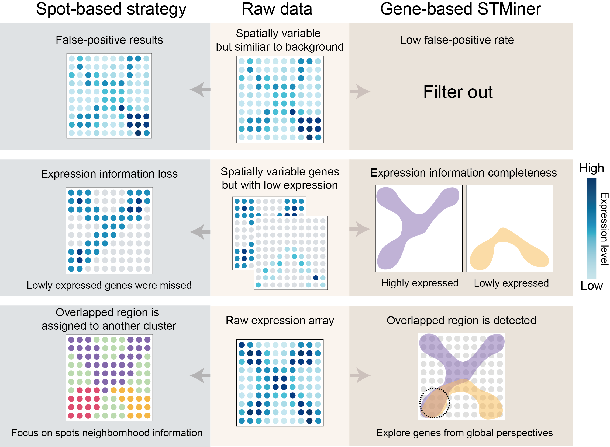

[](https://stminerdoc.readthedocs.io/en/latest/?badge=latest) 

<div align=center></div>

# Introduction
Why STMiner?

ST data presents challenges such as uneven cell density distribution, low sampling rates, and complex spatial structures. Traditional spot-based analysis strategies struggle to effectively address these issues. STMiner explores ST data by leveraging the spatial distribution of genes, thus avoiding the biases that these conditions can introduce into the results.


Here we propose “STMiner” based on the Gaussian mixture model to solve this problem. STMiner is a bottom-up methodology
algorithm. It is initiated by fitting a parametric model of gene spatial distributions and constructing a distance array
between them utilizing the Hellinger distance. Genes are clustered, thereby recognizing spatial co-expression patterns
across distinct gene classes.


# Quick start by example
**Please visit [STMiner Documents](https://stminerdoc.readthedocs.io/en/latest/Introduction/Introduction.html) for installation and detail usage.**

## import package

```python
from STMiner import SPFinder
```

## Load data

You can download test data [here](https://www.ncbi.nlm.nih.gov/geo/query/acc.cgi?acc=GSM4838133).

```python
sp = SPFinder()
file_path = 'D://10X_Visium_hunter2021spatially_sample_C_data.h5ad'
sp.read_h5ad(file=file_path)
```

## Find spatial high variable genes

```python
sp.get_genes_csr_array(min_cells=500, log1p=False)
sp.spatial_high_variable_genes()
```

You can check the distance of each genes by

```python
sp.global_distance
```

| Gene  | Distance |
|-------|----------|
| geneA | 9998     |
| geneB | 9994     |
| ...   | ...      |
| geneC | 8724     |

## Preprocess and Fit GMM

```python
sp.fit_pattern(n_comp=20, gene_list=list(sp.global_distance[:1000]['Gene']))
```

Each GMM model has 20 components.

## Build distance matrix & clustering

```python
sp.build_distance_array()
sp.cluster_gene(n_clusters=6, mds_components=20)
```

## Result & Visualization

The result is stored in **genes_labels**:

```python
sp.genes_labels
```

The output looks like the following:

|    | gene_id        | labels |
|----|----------------|--------|
| 0  | Cldn5          | 2      |
| 1  | Fyco1          | 2      |
| 2  | Pmepa1         | 2      |
| 3  | Arhgap5        | 0      |
| 4  | Apc            | 5      |
| .. | ...            | ...    |
| 95 | Cyp2a5         | 0      |
| 96 | X5730403I07Rik | 0      |
| 97 | Ltbp2          | 2      |
| 98 | Rbp4           | 4      |
| 99 | Hist1h1e       | 4      |

### To visualize the patterns:

```python
sp.get_pattern_array(vote_rate=0.3)
sp.plot.plot_pattern(vmax=99,
                     heatmap=False,
                     s=5,
                     reverse_y=True,
                     reverse_x=True,
                     image_path='E://cut_img.png',
                     rotate_img=True,
                     k=4,
                     aspect=0.55)
```

<div  align="center">    
  
</div>

### Visualize the intersections between patterns 3 & 1:

```python
sp.plot.plot_intersection(pattern_list=[0, 1],
                          image_path='E://OneDrive - stu.xjtu.edu.cn/paper/cut_img.png',
                          reverse_y=True,
                          reverse_x=True,
                          aspect=0.55,
                          s=20)
```

<div  align="center">    
  
</div>

### To visualize the gene expression by labels:

```python
sp.plot.plot_genes(label=0, vmax=99)
```

## Attribute of STMiner.SPFinder Object

| Attribute            | Type         | Description                             |
|----------------------|--------------|-----------------------------------------|
| adata                | Anndata      | Anndata for loaded spatial data         |
| global_distance      | pd.DataFrame | OT distance between gene and background |
| genes_labels         | pd.DataFrame | Gene name and their pattern labels      |
| genes_patterns       | dict         | GMM model for each gene                 |
| genes_distance_array | pd.DataFrame | Distance between each GMM               |
| kmeans_fit_result    | obj          | Result of k-means                       |
| mds_features         | pd.DataFrame | embedding features after MDS            |

